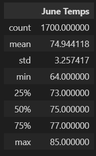
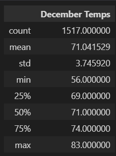
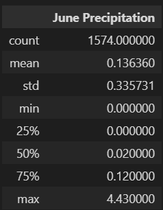
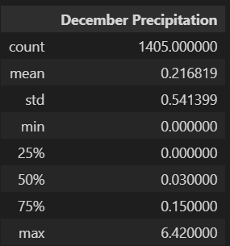

# Surfs Up Challenge

## Overview of Surfs Up Analysis

Analyzing weather data through a [SQLite database](/hawaii.sqlite) before determining investment eligibility in a Surf and Shake shop in Hawaii.

## Surfs Up Analysis Results

### Results: Provide a bulleted list with three major points from the two analysis deliverables. Use images as support where needed.

#### Hawaii Temperature Summer Stats for June and December
 

- June temperatures are, of course, warmer than December, but only by a few degrees for each summary statistic.
- The minimum temperature shows the greatest difference between December and June; showing 56 for December and 64 for June, as seen in the images above.
- The maximum temperatures for each month are the closest with 83 for December and 85 for June. With that and the average temperatures around 70, this data suggests a fairly stable temperature year-round for Hawaii.

## Surfs up Analysis Summary

### Summary: Provide a high-level summary of the results and two additional queries that you would perform to gather more weather data for June and December.
- The temperature summary statistics show only slightly lower temperatures for December compared to June. Not much variation, only about 3 degrees difference for each statistic.
- Two additional queries that can be done to gather more data for June and December would be to check precipitation numbers for each month:
  - `june_prcp = session.query(Measurement.date, Measurement.prcp).filter(extract('month', Measurement.date) == 6).all()`
  - `dec_prcp = session.query(Measurement.date, Measurement.prcp).filter(extract('month', Measurement.date) == 12).all()`
-  By simply adjusting the query for the temperatures to search instead for the precipitation data for both June and December, we can get the summary statistics regarding the precipitation for each month, as shown below. Precipitation doesn't vary much between the two. December's max comes out slightly higher than June's.

 

## Resources
- Data Source: [Hawaii Weather Data](/hawaii.sqlite)
- Software: [Python](https://www.python.org/), 3.7.6, [Visual Studio Code](https://code.visualstudio.com/), 1.65.2, Anaconda, Jupyter Notebooks
